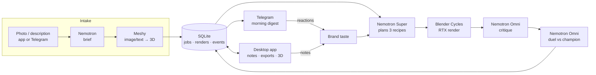

# Night Studio

**An autonomous product-photo studio that works all night on one RTX GPU.** You give it a product (a phone photo, a few words, or both). While you sleep, it plans shots, renders them in Blender, critiques them and keeps the best ones. It learns your brand's taste from your reactions. In the morning you get the winning images on Telegram.

🗼 Built for the **NVIDIA Paris Claw Agent Challenge**, with NVIDIA Nemotron.

---

## What it does

Small online brands need good product photos and can't book a studio every week. Night Studio replaces that shoot with an agent that runs for hours without supervision:

1. **Intake.** Send a product photo, a short description, or both, from the desktop app or the Telegram bot (`/new <description>`).
   - Nemotron writes the creative brief.
   - Meshy turns the photo or the text into a textured 3D model.
2. **Night loop.** The studio keeps a *champion* image for every product and tries to beat it, generation after generation:
   - **Plan.** Nemotron Super proposes 3 shot recipes (lights, HDRI, camera, background, pedestal):
     - `refine` fixes the art director's last critique;
     - `explore` tries a bold new mood;
     - `taste` applies the brand's learned preferences.
   - **Render.** Headless Blender Cycles renders each recipe on the RTX (OptiX), in about 5 s per 1080×1350 image.
   - **Critique.** Nemotron Omni, acting as a harsh art director, looks at each image. It scores composition, lighting, background, product clarity and commercial appeal, and lists concrete fixes.
   - **Duel.** The best challenger faces the champion side by side, judged in both orders to cancel position bias. The winner becomes the new champion.
3. **Morning digest.** At `DIGEST_AT`, each product's champion and two strong alternatives are sent to Telegram with reaction buttons: love, ok, no, more minimal, warmer, lifestyle, moodier.
4. **Taste learning.**
   - Reactions and free-text notes from the app are distilled into a versioned brand-taste file.
   - The planner reads that file every generation.
   - When the brand and the art director disagree, the brand wins, and the planner explains how it reconciled the two.

## Deliverables

- **4K export**: the same recipe re-rendered at 3072×3840 with 256 samples.
- **3D model and scene**: a GLB of the product on its pedestal, plus a self-contained `.blend` scene.
- **Real-time 3D viewer** in the app (three.js). It uses the render's own GLB, HDRI, lights and camera, so you can orbit the product exactly as it was shot.
- **Hero clip**: a camera move with a slight product rotation (`npm run clip`). There is also a 360° turntable (`npm run turntable`).

## Built to run for a long time

- **Everything is state in SQLite** (jobs, renders, critiques, duels, feedback, events). Restart the agent and it continues where it stopped.
- **Round-robin over products**, so a new product joins the loop without restarting anything.
- **Failure isolation.** A Blender crash or timeout costs one render, never the agent. Malformed model JSON is repaired or retried, and a failed critique marks one render as failed instead of stopping the generation.
- **Rate limiting.** Every NVIDIA call (planner, critic, intake) goes through one sliding-window limiter capped at 30 requests per minute, retries included. The account limit is 40. Measured usage is about 5 requests per minute.
- **Backoff.** 429 and 5xx responses are retried with exponential backoff. A persistent 403 pauses the loop instead of hammering the API.
- **Observable.** Every step is an event, streamed to the app's agent log and live counters (renders, GPU time, Nemotron calls per minute, champions).

## Architecture



| Part | Tech |
| --- | --- |
| Agent | Node.js 24 (TypeScript run directly), `node:sqlite` |
| Planning | `nvidia/nemotron-3-super-120b-a12b` (build.nvidia.com) |
| Vision critique, duels, photo briefs | `nvidia/nemotron-3-nano-omni-30b-a3b-reasoning` |
| Rendering | Blender 5.2 headless, Cycles + OptiX, Poly Haven CC0 HDRIs and models |
| 3D from photo or text | Meshy API (image-to-3D, text-to-3D with PBR textures) |
| Desktop app | Tauri v2, Svelte 5, Tailwind v4 + DaisyUI v5, GSAP, three.js |
| Notifications | Telegram Bot API (long polling, inline keyboards) |
| Video | ffmpeg (clips, turntables, rushes) |

## Getting started

**Requirements:**
- Windows with an NVIDIA RTX GPU
- Node.js 24+
- Blender 5.x
- Rust (only to run the desktop app)
- ffmpeg on the `PATH` (clips and rushes)

**Setup:**
1. Copy the environment template and fill in `.env`:
   ```bash
   cp .env.example .env
   ```
   You need:
   - an NVIDIA API key from build.nvidia.com;
   - a Telegram bot token from @BotFather (get your chat id with `npm run chat-id` after sending `/start` to the bot);
   - a Meshy API key.
2. Install the dependencies:
   ```bash
   npm install
   ```
   ```bash
   npm install --prefix ui
   ```

**Launch.** Double-click `start-night-studio.bat`. It starts the agent in its own window, then the desktop app. Or start them by hand:

```bash
npm start
```
```bash
cd ui && npm run tauri dev
```

**First product.** Click **Add a product** in the app, or add a Poly Haven model from the command line:

```bash
npm run add-job -- polyhaven:ceramic_vase_01 "Handmade ceramic vase" "Hero image for a small Etsy ceramics shop. Calm, warm, premium-minimal."
```

## Scripts

| Command | What it does |
| --- | --- |
| `npm start` | The agent: night loop, morning digest, Telegram listener, local API on `127.0.0.1:8787` |
| `npm run add-job -- <polyhaven:id \| model.glb> "<name>" "<brief>"` | Add a product from a 3D model |
| `npm run generation` | Run generations by hand (testing) |
| `npm run digest` | Send the morning digest now |
| `npm run export -- <renderId>` | 4K PNG + GLB + `.blend` for one render |
| `npm run clip -- <renderId> [frames] [samples]` | Hero clip with a moving camera (MP4) |
| `npm run turntable -- <jobId> [frames] [samples]` | 360° turntable of a product's champion |
| `npm run rushes` | Video rushes from the studio's data (lineage, flipbook, before/after) |
| `npm run record-ui -- <seconds> <name>` | Record the app window only |
| `npm run chat-id` | Show the Telegram chat ids that wrote to the bot |

Renders, exports, rushes and the database live in `~/.night-studio` (override with `STUDIO_DIR`).

## Project layout

```text
src/llm.ts              Nemotron client: rate limiter, retries, tool loop, JSON repair
src/studio/main.ts      Long-running loop, morning digest, startup
src/studio/night.ts     One generation: plan → render → critique → duel → champion
src/studio/planner.ts   Nemotron Super recipe planner (refine / explore / taste)
src/studio/critic.ts    Nemotron Omni critique and pairwise duels
src/studio/taste.ts     Brand taste learning from reactions and notes
src/studio/intake.ts    Photo or description → brief → Meshy 3D → new product
src/studio/export.ts    4K export, GLB for the 3D viewer, .blend scene
src/studio/telegram.ts  Morning digest, reactions, photo and /new intake
src/studio/api.ts       Local HTTP API for the desktop app
blender/render.py       Headless Blender scene builder and renderer
ui/                     Tauri + Svelte desktop app
scripts/                CLI tools (exports, clips, rushes, recording)
```

## Credits

- HDRIs and demo models: [Poly Haven](https://polyhaven.com) (CC0).
- 3D generation: [Meshy](https://www.meshy.ai).
- Language and vision models: NVIDIA Nemotron via [build.nvidia.com](https://build.nvidia.com).
